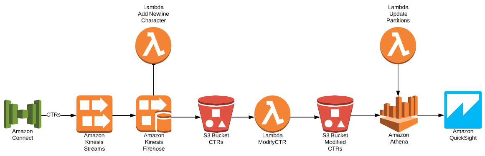

# Welcome to Visualize Amazon Connect Contact Trace Records using Amazon QuickSight Workshop
This repository contains the files used in the [Visualize Amazon Connect Contact Trace Records using Amazon QuickSight Workshop](https://catalog.us-east-1.prod.workshops.aws/v2/workshops/607718a8-cddd-416a-97b4-4fc9dc93ff7a/en-US/).  The repository contains two folders:
1. scripts - This contains Bash, Python, and CloudFormation scripts that will be executed during the workshop.  The folders represent the functionality that the workshop deploys
1. lambdas - This contains the lambda functions that will be deployed by the scripts

## Overview
Although [Amazon Connect](https://aws.amazon.com/connect/) has [built-in reports](https://docs.aws.amazon.com/connect/latest/adminguide/amazon-connect-metrics.html), some customers need more flexibility or need to use a Business Intelligence (BI) Tool to visualize Amazon Connect data.  In this workshop, you will learn how to visualize Amazon Connect [Contact Trace Records](https://docs.aws.amazon.com/connect/latest/adminguide/ctr-data-model.html) (CTR) using [Amazon QuickSight](https://aws.amazon.com/quicksight/).  The workshop focuses on automation that you can insert into your CI/CD pipelines.

## The workshop is building this solution
1. Amazon Connect exports CTRs by sending the data to an [Amazon Kinesis Data Stream](https://aws.amazon.com/kinesis/data-streams/)
1. [Amazon Kinesis Data Firehose](https://aws.amazon.com/kinesis/data-firehose/) is used to deliver the CTRs, that are in the Kinesis Data Stream, to [Amazon S3](https://aws.amazon.com/s3/).  The CTRs are delivered as a batch of records so the S3 object will contain multiple CTRs.  [AWS Lambda](https://aws.amazon.com/lambda/) is used to add a newline character to each record, which makes the object easier to parse. 
1. [Amazon S3 Event Notification](https://docs.aws.amazon.com/AmazonS3/latest/userguide/NotificationHowTo.html) is used to send an event to the ModifyCTR Lambda function, which you will learn about in this workshop. The Lambda function saves the modified records to S3.
1. [Amazon Athena](https://aws.amazon.com/athena/) queries the modified CTRs using standard SQL.  [Athena partitions](https://docs.aws.amazon.com/athena/latest/ug/partitions.html) are used to restrict the amount of data scanned by each query, thus improving performance and reducing cost.  A Lambda function is used to maintain the partitions.
1. Amazon QuickSight is used to visualize the modified CTRs.

Please visit the workshop for additional details.